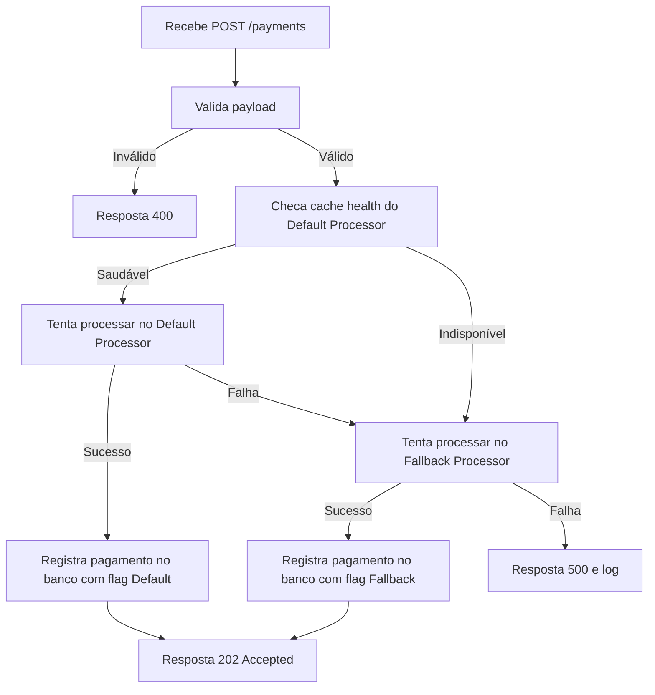
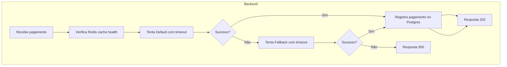

# Estratégia para Payment Processors

**Objetivo:**

* Priorizar o **Payment Processor Default** que tem a menor taxa (5%) para maximizar lucro.
* Usar o **Fallback** somente se o Default estiver indisponível ou lento demais.
* Minimizar latência para conseguir bônus no p99.
* Garantir consistência e registro seguro dos pagamentos para evitar multas.

---

# Fluxo ideal simplificado

---

# Componentes Técnicos recomendados

| Requisito                         | Tecnologia ou estratégia recomendada                 | Justificativa                                                                               |
| --------------------------------- | ---------------------------------------------------- | ------------------------------------------------------------------------------------------- |
| Cache de health dos processadores | **Redis** com TTL de 5s (rate-limit do health-check) | Evita chamadas frequentes ao endpoint health-check (que é limitado a 1 chamada a cada 5s).  |
| Comunicação rápida                | **HTTP Client com timeout curto (ex: 200-300ms)**    | Minimiza impacto no p99 e garante failover rápido.                                          |
| Retry e fallback                  | Código customizado com fallback imediato             | Tenta Default, se erro/timeout tenta Fallback; evita long waits para melhorar latência.     |
| Persistência transacional         | **PostgreSQL** com transação                         | Garantir registro seguro de pagamentos e evitar inconsistências.                            |
| Mensageria assíncrona             | **NATS** ou **RabbitMQ** (opcional)                  | Pode ser usado para filas e retry assíncrono, mas pode adicionar latência se não bem feita. |
| Lock distribuído                  | **Redis Redlock** (opcional)                         | Para evitar duplicidade em ambiente com múltiplas instâncias de backend.                    |

---

# Detalhes da estratégia

### 1. Cache do health-check

* O health-check `/payments/service-health` dos Processadores tem limite 1 chamada a cada 5 segundos (HTTP 429 se ultrapassar).
* Use Redis para armazenar o status dos dois processadores, atualizado a cada 5s (cache TTL 5s).
* No momento de receber um pagamento, leia do cache para saber se deve tentar Default ou ir direto para fallback.

### 2. Timeout curto e fallback imediato

* Configure um HTTP client com timeout baixo (ex: 200ms a 300ms).
* Ao enviar para o Default Processor, se timeout ou erro >= 500, imediatamente tente fallback.
* Evite retry síncrono no mesmo processador para não aumentar latência.

### 3. Registro confiável no banco

* Após sucesso na chamada para o processador, registre o pagamento na base Postgres (idempotência baseada no `correlationId`).
* Registre qual processador respondeu com sucesso (`default` ou `fallback`).
* Use transações para garantir consistência.

### 4. Consistência do summary

* Para `GET /payments-summary` consulte a base e agrupe os totais por processador (`default` e `fallback`).
* Este endpoint será auditado, então mantenha dados consistentes e sempre atualizados.

---

# Tecnologias recomendadas

* **Redis:** para cache dos health-checks e possível lock distribuído.
* **PostgreSQL:** banco transacional para pagamentos e consultas.
* **fasthttp ou net/http:** cliente HTTP com timeout e contexto cancelável para chamada aos processadores.
* **(Opcional) Mensageria (NATS/RabbitMQ):** para desacoplar processamento, retry assíncrono e escalabilidade futura (com cuidado para não aumentar latência).
* **Docker Compose:** para containerização, incluindo Redis, PostgreSQL e backend.

---

# Resumo técnico para implementar

---

Quer que eu te ajude a escrever o código base para o caso de uso e para o cache Redis com health-check, ou um exemplo de chamada HTTP com timeout + fallback?
